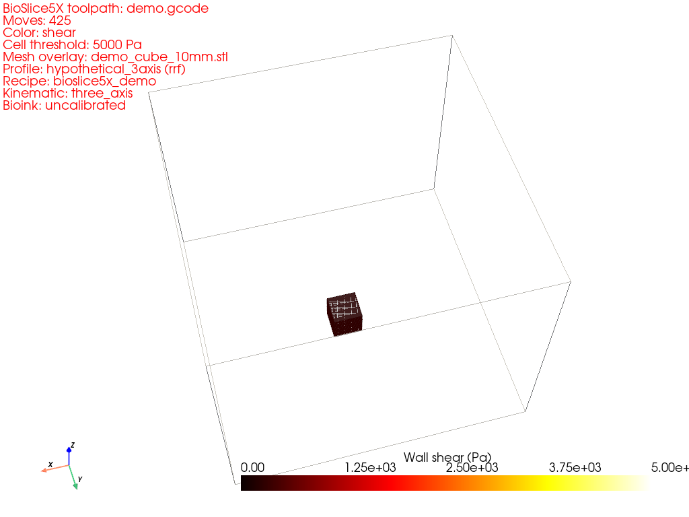
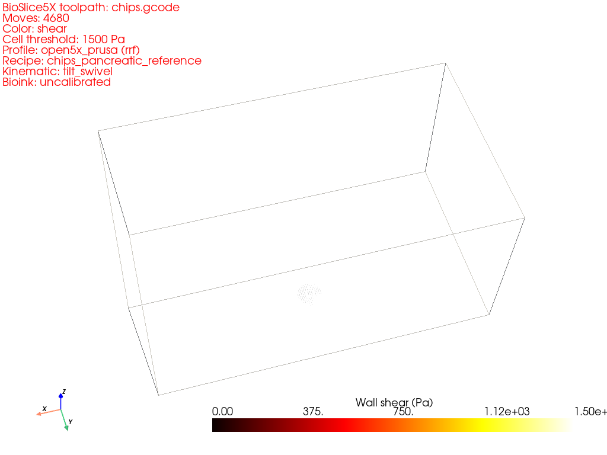
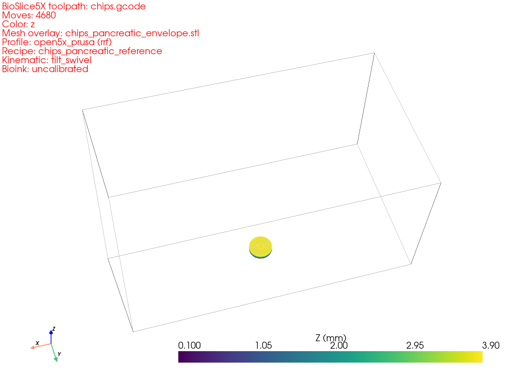

# BioSlice5X

[](https://github.com/alphadi10/bioslice5x/actions/workflows/ci.yml)
[](LICENSE)
[](pyproject.toml)

**Open-source 5-axis slicer for syringe-based bioprinting.** Target
workflow: FRESH (Freeform Reversible Embedding of Suspended Hydrogels)
into a gelatin support bath, with multi-syringe coordinated deposition
and cell-viability-aware path validation.

| Z-height colored toolpath | Wall shear stress, MIN6 1.5 kPa threshold | Source-mesh overlay |
|---|---|---|
|  |  |  |

**Status: v0.1.1-dev.** Phases 1 → 2d + Phase 4/5 viewer + bbox region
selector shipped. Single- and multi-syringe flat and wrap-around-axis
slicing produces valid RepRapFirmware G-code for the Open5X Prusa and
Voron profiles. The CHIPS T1D reference recipe (fibrin/MIN6 core +
collagen shell) prints end-to-end with per-syringe `bbox` regions.

## Why this exists

Existing open-source 5-axis slicers (notably
[Open5X](https://github.com/FreddieHong19/Open5x)) target FDM thermoplastic
printing. Commercial bioprinting software (Cellink, Allevi, BIO INX) is
closed-source and 3-axis only. There is no open-source 5-axis slicer for
syringe bioprinting. BioSlice5X fills that gap.

## Quickstart

The fastest path to a working viewer window:

```bash
git clone https://github.com/alphadi10/bioslice5x
cd bioslice5x
uv sync --all-extras --dev
uv run bioslice5x demo            # opens the viewer on a sliced 10mm cube
```

This is the **one-command first-run validation** — it generates a cube
mesh in memory, slices it on the always-shipped `hypothetical_3axis`
profile, and opens the viewer with shear coloring + mesh overlay. Use
this to verify your install works before you commit cells to a print.

For headless / CI / screenshot mode:

```bash
uv run bioslice5x demo --screenshot demo.png    # PNG, no window
uv run bioslice5x demo --no-viewer              # just slice
```

Manual slicing with one of the bundled samples:

```bash
uv run bioslice5x slice samples/cube_10mm.stl \
    --profile hypothetical_3axis \
    --recipe samples/cube_collagen_recipe.yaml \
    --output out.gcode

# The CHIPS T1D reference recipe (fibrin/MIN6 core + collagen shell):
uv run bioslice5x slice samples/chips_pancreatic_envelope.stl \
    --profile open5x_prusa \
    --recipe samples/chips_pancreatic_recipe.yaml \
    --output chips.gcode
```

See [`docs/tutorial/quickstart.md`](docs/tutorial/quickstart.md) for the
full walkthrough.

## Install from source (for collaborators)

Two paths, depending on your Python tooling:

```bash
# Path 1 — uv (recommended; matches the project's dev setup):
git clone https://github.com/alphadi10/bioslice5x
cd bioslice5x
uv sync --all-extras --dev

# Path 2 — pip from git, no clone:
pip install "bioslice5x[viz] @ git+https://github.com/alphadi10/bioslice5x"
```

Either path gives you the `bioslice5x` CLI on your `$PATH`. The `[viz]`
extra pulls in PyVista for the 3D viewer; without it the CLI's `slice`
and `dry-run` subcommands still work, but `preview` and `demo` will tell
you to install the extra.

Once you have a green local test run (`uv run pytest`), you're ready to
swap in your own recipes and profiles — the bundled samples are
deliberately self-contained so you can copy them as templates.

## 3D toolpath viewer

After slicing, inspect the result:

```bash
# Default — extrusion moves colored by Z height (PrusaSlicer-style).
uv run bioslice5x preview out.gcode --profile open5x_prusa

# Color by per-segment wall shear stress, with red marking the
# cell-viability threshold (MIN6 β-cells: 1500 Pa).
uv run bioslice5x preview out.gcode --profile open5x_prusa \
    --color-by shear --stress-threshold-pa 1500

# Overlay the source STL semi-transparent — compare printed vs asked-for.
uv run bioslice5x preview out.gcode --profile open5x_prusa \
    --mesh samples/cube_10mm.stl
```

In the interactive window, the layer-scrubber slider at the bottom-left
controls how many layers are visible. The "Preview toolpath" button in
the Tkinter GUI launches the same viewer with the active color mode and
mesh-overlay toggles. See [ADR-005](docs/adr/0005-phase5-viewer-scope.md)
for the design.

## Hardware target

3-axis Cartesian XYZ + tilt and swivel rotaries on the build platform,
matching Open5X's kinematic family. Four real-machine profiles ship,
one per chassis variant documented in the upstream Open5X repo:

- **`open5x_prusa`** (default) — Prusa i3, Version_Save 2021 firmware: tilt = **A** about X, swivel = **C** about Z. Tilt range ±200°.
- **`open5x_prusa_uv`** — Prusa i3, current upstream firmware that exposes rotaries as **U** (tilt) + **V** (swivel). Same physical kinematics; different G-code letters.
- **`open5x_voron`** — Voron 0 conversion: tilt = **B** about Y, swivel = **C** about Z. Tilt range ±110°.
- **`open5x_jubilee`** — Jubilee Toolchanger conversion: tilt = **B** about Y, swivel = **C** about Z. Tilt range ±200°.

Plus `hypothetical_3axis` (no rotaries) for bench-testing the pipeline
on a stock 3-axis printer.

Adding a new machine profile is a YAML file in
`src/bioslice5x/profile/library/`; no code changes required for the same
kinematic family. See [`docs/PHASE_2B_NOTES.md`](docs/PHASE_2B_NOTES.md)
for the worked examples and
[`docs/OPEN5X_NOTES.md`](docs/OPEN5X_NOTES.md) for the upstream-reference
conventions.

**Before the first print on any new build**, run
`samples/commissioning_rotary_sign_check.gcode` to verify the rotary sign
convention matches the right-hand rule the slicer assumes. Wrong-sign
rotaries produce mirrored toolpaths that collide with deposited geometry.
The check is 60 seconds; the fix (`invert: true` in the profile YAML) is
one line. See `docs/OPEN5X_NOTES.md` §2.

RepRapFirmware (Duet 2/3) G-code dialect. Marlin support is a v0.2.0+
deliverable.

## Key design properties

- **Cell viability is a hard constraint.** The slicer refuses to emit
  G-code that violates configured per-bioink shear-stress thresholds.
  See [ADR rationale](docs/BIOPRINTING_REQUIREMENTS.md).
- **Calibration provenance everywhere.** Every empirical parameter
  (bioink rheology, cell-shear thresholds, bath drag multipliers)
  carries a `calibrated_against` field. The G-code header surfaces
  calibration status via a `;META:` block.
- **General-form code paths from day one.** Recipe regions, kinematic
  chains, slicing modes, print orientation, and bath models all
  dispatch by `kind`; new variants are siblings, never special-case
  code paths.
- **ADRs for user-visible decisions.** Behaviour decisions with
  multiple plausible alternatives get an ADR before implementation.
  See [`docs/adr/`](docs/adr/).
- **Doctest-locked worked examples.** Every numerical example in the
  docs is pinned by a test that re-derives the value. Prose drifts;
  doctests don't.

## Documentation

- [`ARCHITECTURE.md`](ARCHITECTURE.md) — module layout, data flow, design
  decisions.
- [`docs/OPEN5X_NOTES.md`](docs/OPEN5X_NOTES.md) — Open5X hardware/firmware
  reference notes.
- [`docs/BIOPRINTING_REQUIREMENTS.md`](docs/BIOPRINTING_REQUIREMENTS.md) —
  FRESH/CHIPS biological constraints translated to engineering requirements.
- [`docs/PHASE_2B_NOTES.md`](docs/PHASE_2B_NOTES.md) — canonical (tilt, swivel)
  → G-code letter mapping with A+C and B+C worked examples.
- [`docs/adr/README.md`](docs/adr/README.md) — Architecture Decision Records.
- [`CONTRIBUTING.md`](CONTRIBUTING.md) — dev setup, Python version policy,
  ADR threshold rule, golden-file regeneration.
- [`LIMITATIONS.md`](LIMITATIONS.md) — what v0.1.0 doesn't do.
- [`CHANGELOG.md`](CHANGELOG.md) — version history.

## Citation

If you use BioSlice5X in published research, please cite:

```
@software{bioslice5x,
  title = {BioSlice5X: open-source 5-axis slicer for syringe bioprinting},
  version = {0.1.0},
  year = {2026},
  url = {https://github.com/bioslice5x/bioslice5x},
}
```

## License

MIT — matching Open5X.

## Calibration disclaimer

All bioink rheology values, cell-shear thresholds, and bath drag
multipliers shipped in v0.1.0 are literature defaults flagged
`calibrated_against: "uncalibrated, literature default"`. Validate
against your own wet-lab data before relying on the slicer's
cell-viability check for publication-grade work. The G-code header
surfaces the calibration status on every emitted file.
